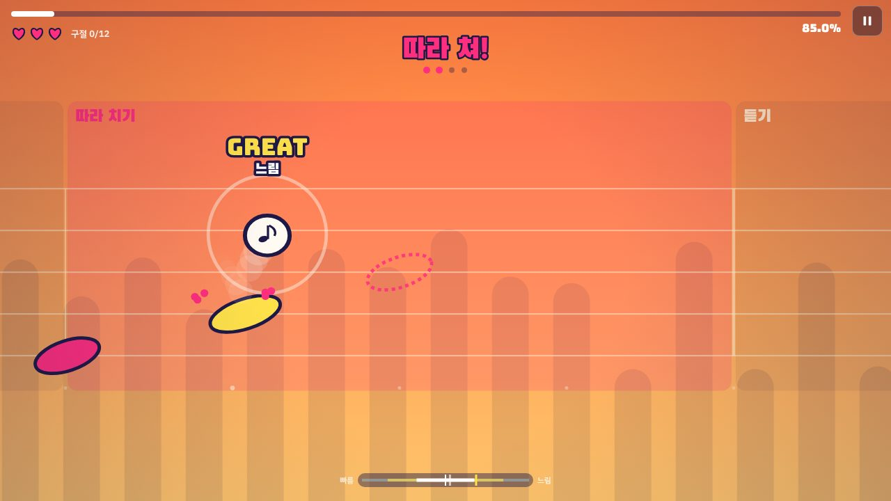

# Memoryz Royale

클래시로얄 스타일의 실시간 카드 배틀 웹 게임 (TypeScript + Three.js 3D 전장 + Phaser 3 UI).


## 실행

```bash
npm install
npm run dev      # http://localhost:5173
npm test         # 게임 로직 단위 테스트
npm run build    # dist/ 에 정적 빌드 (GitHub Pages 등에 그대로 배포 가능)
```

## 플레이 방법

- 메뉴의 **덱 편집**에서 15장 중 8장으로 덱을 짭니다 (브라우저에 저장됨).
- 메뉴에서 AI 난이도(쉬움/보통/어려움)를 고릅니다. AI는 준비된 덱 3개 중 하나를 씁니다.
- 아래 카드를 **끌어서** 전장에 놓거나, 카드를 **탭한 뒤 전장을 탭**해서 배치합니다.
- 빨갛게 칠해진 곳에는 유닛을 놓을 수 없습니다 (주문은 어디든 가능).
  상대 프린세스 타워를 부수면 그 라인의 강 건너편까지 배치할 수 있습니다.
- 3분 경기, 마지막 1분은 엘릭서 2배. 동점이면 1분 연장전(먼저 크라운을 따면 승리).
- 킹타워를 부수면 즉시 3크라운 승리.

## 카드 (`src/data/cards.json`)

| 카드 | 비용 | 특징 |
| --- | --- | --- |
| ⚔️ 기사 | 3 | 튼튼한 근접 유닛 |
| 🏹 궁수 | 3 | 원거리 2명, 공중 공격 가능 |
| 🗿 자이언트 | 5 | 건물만 공격하는 탱커 |
| 👺 고블린 | 2 | 빠른 근접 3마리 |
| 🐉 아기 드래곤 | 4 | 공중 유닛, 범위 공격 |
| 💀 해골 군대 | 3 | 약한 해골 12마리 |
| 🔥 파이어볼 | 4 | 범위 주문 (타워에는 35% 피해) |
| 💣 대포 | 3 | 지상 방어 건물, 30초 후 소멸 |
| 🔫 머스킷병 | 4 | 긴 사거리, 공중 공격 가능 |
| 🤖 미니 페카 | 4 | 한 방이 매우 센 근접 유닛 |
| 🐗 호그 라이더 | 4 | 빠름, 건물만 공격, 강을 뛰어넘음 |
| 🪓 발키리 | 4 | 주변 360° 범위 공격 |
| 🦇 미니언 | 3 | 공중 유닛 3마리 |
| 🧨 폭탄병 | 2 | 원거리 범위 공격 (지상만) |
| 🎯 화살 | 3 | 넓은 범위의 약한 주문 |

밸런스는 `cards.json`의 숫자만 바꾸면 됩니다.

## 🏍️ 네온 라이더 (`ride.html`)

웹캠으로 **몸을 기울여 조종하는** 네온 고속도로 오토바이 게임. 기획서: [docs/RIDE_PLAN.md](docs/RIDE_PLAN.md)

| 주행 | 충돌 → WASTED |
| --- | --- |
|  |  |

- `npm run dev` 후 http://localhost:5173/ride.html (배포본은 `/memoryz/ride.html`, Royale 메뉴 왼쪽 위 링크로도 이동)
- **웹캠**: 두 주먹을 가슴 앞에 들면 핸들을 잡은 것으로 인식해 출발합니다(처음 1.5초 보정).
  핸들 돌리듯 한 손을 내리거나 몸을 기울이면 방향 전환, 화면 쪽으로 숙이면 부스터,
  손을 내리면 브레이크, 두 손을 머리 위로 1초 올리면 다시 시작.
- **키보드/터치**: ← → 방향 · ↓ 브레이크 · Space 부스터 · R 다시 시작 · M 소리 / 화면 좌우 누르기, 두 손가락 부스터
- 차 사이를 1.3m 이내로 스치면 아슬아슬 보너스(콤보) + 부스터 충전. 차에 부딪히면 라이더가 날아가며 슬로모션 → 흑백 → **WASTED**.
- 자세 인식은 MediaPipe Pose(lite)로 브라우저 안에서만 처리합니다. wasm은 빌드에 포함되고, 모델 파일(5.7MB)만 Google 저장소에서 받습니다.

```
src/ride/core/     순수 로직: 바이크·교통·충돌·점수·충돌 후 물리(sim.ts), 포즈→조작 변환(controls.ts)
src/ride/input/    웹캠 + MediaPipe(pose.ts), 키보드/터치(keyboard.ts)
src/ride/render/   Three.js: 도로·도시·네온(road.ts), 차량(vehicles.ts), 콕핏·라이더(bike.ts), 속도계(dashboard.ts), 카메라·후처리(scene.ts)
src/ride/ui/       HUD·오버레이(hud.ts), 웹캠 스켈레톤(skeleton.ts)
tests/ride/        sim / controls 단위 테스트
```

## 🎵 메아리 바운스 (`beat.html`)

음악이 한 마디 동안 멜로디를 **부르면**, 다음 마디(허공)에 들은 리듬을 **따라 쳐서** 음표 발판을 만들고, 공이 그 위를 밟고 건너가는 리듬 게임.
기획서: [docs/BEAT_PLAN.md](docs/BEAT_PLAN.md)

| 트랙 목록 (뒤에서 1번 트랙 데모) | 플레이 |
| --- | --- |
|  |  |

- `npm run dev` 후 http://localhost:5173/beat.html (배포본은 `/memoryz/beat.html`)
- **잘 들어** 마디: 멜로디가 나오고 오선 위에 음표가 저절로 생긴다. **따라 쳐!** 마디: 비어 있는 오선에 같은 리듬을 쳐서 음표를 놓는다. 내 탭이 그 음을 연주한다.
- 놓치면 공이 떨어지고 하트 −1(음악은 계속, 다음 구절에 다시 등장). 구절을 완벽히 따라 치면 하트 +1. 하트 3개를 다 잃으면 처음부터.
- 오선 위 음표에 기둥과 8분음표 빔까지 그려서 지나온 길이 실제 악보가 된다.
- 트랙 3개: 메아리(96 BPM) · 돌림노래(112, 8분음표·엇박) · 높은음 낮은음(120, ↓/↑ 두 키로 음 높이까지).
- 메아리 그림자(점선 힌트), 무한 하트(연습), 싱크 조절, 빠름/느림 타이밍 막대, 결과 타이밍 분포.

```
src/beat/core/     규칙(echo.ts), 트랙(levels.ts), 판정(judge.ts), 기록(records.ts)
src/beat/audio/    합성 밴드 + 부르기 멜로디 + 탭 소리 + 오디오 시계(music.ts)
src/beat/render/   오선지·음표·공·HUD(draw.ts)
tests/beat/        규칙 테스트 + 모든 트랙 자동 검증
```

## 🤖 개인 비서 (`assistant.html`)

원하는 주제의 **최신 소식만 골라 요약**하고, 말하듯 적은 **일정을 정리**하고, **보낼 메시지 초안**을 써 주는 웹앱.
[클로드 코드로 앱 만드는 프롬프트 8가지](https://every-ai-guides.vercel.app/posts/claude-code-app-prompts-8)를 따라 단계별로 만든 연습 프로젝트입니다
(계획: [docs/PRACTICE_PLAN.md](docs/PRACTICE_PLAN.md), 단계별 기록: [docs/assistant/](docs/assistant/)).

| 소식 브리핑 | 일정 확인 카드 | 메시지 초안 |
| --- | --- | --- |
| 주제를 최대 5개 등록 → Claude가 웹 검색해서 주제별 요약 + 출처 링크 (한국어·영어 기사, 요약은 한국어) | "다음 주 화요일 3시 강남역에서 민수랑 미팅" → 날짜·시간·장소를 채운 카드를 확인하고 저장. `.ics` 파일로 공유 | 받는 사람·하고 싶은 말·말투 → 초안 2개, 복사해서 카톡에 붙여 넣기. 일정에서 바로 알림 메시지 쓰기 |

- `npm run dev` 후 http://localhost:5173/assistant.html (배포본은 `/memoryz/assistant.html`)
- **두 가지로 쓸 수 있습니다** (같은 코드, 열린 곳을 보고 자동으로 바뀜):

  | | API 키 버전 (GitHub Pages) | 키 없는 버전 (Claude 아티팩트) |
  | --- | --- | --- |
  | 주소 | https://memoryzkr-hash.github.io/memoryz/assistant.html | https://claude.ai/artifact/WfjDL1p8rgtVcXm4qPobLd (claude.ai 로그인, 공유 설정 필요) |
  | AI | 내 Anthropic API 키 | 내 Claude 계정 (`sample`), 쓴 만큼 Claude 사용량에서 차감 |
  | 소식 | Claude가 **웹 검색**해서 주제별 요약 | 웹 검색 불가 → **붙여 넣은 기사**를 주제별로 정리 |
  | 저장 | 이 브라우저 (`localStorage`) | 내 Claude 계정에 비공개 저장 (`data/users/<id>/`), 기기 간 이어짐 |
  | 일정 공유 | Google 캘린더 링크 + `.ics` 파일 | Google 캘린더 링크 (아티팩트는 파일 다운로드 차단) |

  아티팩트 빌드: `npm run build:artifact` → `dist-artifact/assistant-artifact.html` (한 파일에 JS·CSS 포함)
- API 키 버전은 처음 열면 **Anthropic API 키**를 넣습니다 ([콘솔](https://console.anthropic.com/settings/keys)에서 발급).
  키는 이 브라우저의 `localStorage`에만 저장되고, 브라우저가 Claude API를 직접 부릅니다 (서버 없음).
  **콘솔에서 월 사용 한도를 꼭 걸어 두세요.** 브리핑 1번 = 주제마다 Claude 호출 1번 + 웹 검색 최대 3번(설정에서 1~5).
- 모델은 `claude-opus-5-5`. 일정 해석·메시지 초안은 effort `low`로 비용을 줄였습니다.
- AI가 없어도 일정은 **＋ 직접 입력**으로 만들 수 있습니다.

```
src/assistant/core/   순수 로직: 글자 수(text.ts), 날짜·시간대(dates.ts), 검증 규칙(rules.ts),
                      저장(store.ts), 캘린더 파일(ics.ts), Claude 응답 검사(validate.ts)
src/assistant/ai.ts   API 키 버전의 Claude 호출 (웹 검색 + submit_briefing 도구, structured outputs)
src/assistant/sampleAi.ts  키 없는 버전의 Claude 호출 (아티팩트 `sample`, 붙여 넣은 기사 정리)
src/assistant/core/dbStorage.ts  아티팩트 계정 저장소를 localStorage 모양으로 감싼 것
src/assistant/prompts.ts  지시문과 JSON 스키마
src/assistant/ui/     화면: 시작(start) 소식(news) 일정(events) 메시지(messages) 설정(settings)
tests/assistant/      166개: 경계 값, 저장소 오류, .ics, 지어낸 출처 차단, 가짜 네트워크로 Claude 호출, 키 없는 모드
```

**알려진 한계**
- API 키 버전: 키가 브라우저에 암호화 없이 저장됩니다 → 개인 기기에서만 쓰세요.
- 키 없는 버전: 웹 검색을 못 해서 최신 소식을 스스로 찾지는 못합니다.
- 데이터는 이 브라우저에만 있습니다. 브라우저 데이터를 지우면 함께 사라지고, 다른 기기와 동기화되지 않습니다.
- 앱이 열려 있을 때만 동작합니다 (정해진 시간 자동 브리핑·알림 없음).
- 진짜 Claude 응답과 실제 휴대폰에서의 복사·`.ics` 열기는 아직 확인 전입니다 ([07-release.md](docs/assistant/07-release.md)). 배포 주소에서 가짜 응답으로 흐름 22개는 확인했습니다.

**다음에 할 일 (우선순위 순)**
1. 진짜 API 키로 [04-build.md](docs/assistant/04-build.md)의 "실행해 보지 못한 것" 확인 — 특히 출처 주소 일치율과 상대 날짜 계산
2. 아이폰 사파리·안드로이드 크롬에서 복사 버튼, `.ics` 파일 열기 확인
3. 메모 기능 (v1에서 뺀 1순위)
4. 브리핑 비용 표시 (응답의 사용량으로 1회 비용 보여 주기)
5. 작은 서버(예: Vercel 함수) 추가 → 키를 서버에 숨기고, 다른 사람과 실시간 일정 공유·정해진 시간 자동 브리핑

## 🧳 여행 플래너 (`travel.html`)

어디든 여행 일정을 짜 주고, 그 일정대로 **움직이는 모습을 지도 위에서 시뮬레이션**하면서 **이동 시간과 비용을 미리 계산**해 주는 웹앱.
기획서: [docs/TRAVEL_PLAN.md](docs/TRAVEL_PLAN.md)

- `npm run dev` 후 http://localhost:5173/travel.html (배포본은 `/memoryz/travel.html`)
- **웹 링크 (claude.ai)**: https://claude.ai/artifact/VA4G8iiHfEjrbRuidBgz3Q — `npm run build:travel-artifact`로 만든 한 파일짜리 판입니다.
  여기서는 API 키 없이 보는 사람의 Claude 계정으로 일정을 만들고, 지도 그림 대신 격자 위 경로도로 보여 줍니다.
- **대화로 계획하기**: 챗봇이 한 번에 하나씩 물어봅니다 — 어디로(못 정했으면 국내/해외 → 분위기 → 추천지), 며칠, 누구랑, 몇 명,
  1인 예산, 일정 밀도, 하고 싶은 것(여러 개), 현지 이동 방법, 첫날 출발 시각. 보기를 누르기만 하면 되고 직접 적어도 됩니다.
  마지막에 요약 카드에서 아무 항목이나 눌러 고친 뒤 **이대로 일정 만들기**. 일정이 나온 뒤에도 같은 대화에서
  **동선 최적화 · 교통비 줄이기**(바로 계산), **더 여유롭게 · 맛집 더 넣기** 또는 아무 말로 고쳐 달라고 할 수 있습니다.
  질문 흐름은 `src/travel/chat/flow.ts` 한 파일에 데이터로 있어 테스트로 확인합니다.
- **화면**: 휴대폰은 대화 → 내 여행(지도) 두 화면, 넓은 화면은 대화 · 지도 · 일정이 한 번에 보입니다. 지도 위 카드에 현재 시각·하는 일·쓴 돈,
  아래에 하루를 한 줄로 그린 시간표 띠(끌어서 아무 시각으로 이동). Space 재생/정지, ← → 이전/다음 장소.
- **AI**: 대화에서 모은 답으로 Claude(`claude-opus-5-5`)가 날짜별 방문지와 좌표를 짭니다. 키는 개인 비서와 같은 `localStorage` 항목을
  함께 쓰고, 일정을 만들 때 대화 안에서 물어봅니다 (claude.ai 링크에서는 키가 필요 없습니다).
- **예측은 AI가 아니라 공식으로**: 직선거리 × 수단별 우회 계수, 수단별 속도·대기 시간, 출퇴근 시간 정체(×1.35), 지역별 요금표(택시 기본요금·심야 할증,
  지하철 거리 비례 요금, 택시는 4명당 1대), 개장 시간 대기, 숙박(2인 1실). 그래서 같은 계획이면 언제나 같은 숫자가 나옵니다.
- **고쳐 보면서 비교**: 구간마다 수단을 바꾸거나 **수단 비교**표에서 고르기, 머무는 시간 ±15분, 순서 바꾸기·빼기(되돌리기), 지도를 눌러 장소 추가,
  **🔀 동선 최적화**(처음·마지막 숙소는 그대로 두고 이동 시간이 가장 짧은 순서로). 바꿀 때마다 시간표·비용·경고(마감 후 도착, 23시 넘김,
  30분 넘는 도보, 예산 초과)가 바로 다시 계산됩니다.

```
src/travel/core/   순수 로직: 거리·경로 곡선(geo.ts), 수단별 시간·요금(modes.ts), 지역 요금표·환율(regions.ts),
                   시간표·비용·경고(schedule.ts), 이동 시뮬레이션(sim.ts), 동선 최적화(optimize.ts), 검사(validate.ts), 저장(store.ts)
src/travel/ai.ts   Claude 호출 (structured outputs JSON 스키마, 거절 시 서버 측 폴백)
src/travel/chat/   대화 질문 흐름: 순서·건너뛰기·답 해석·추천지(flow.ts)
src/travel/core/tweaks.ts  대화에서 바로 하는 수정: 동선 최적화, 교통비 줄이기
src/travel/ui/     대화(chat.ts), Leaflet 지도(map.ts), 재생기·시간표 띠(player.ts), 일정·비용·정보 탭(panel.ts), 장소 추가 시트(create.ts)
scripts/build-travel-artifact.mjs  claude.ai 링크용 한 파일 빌드 (dist-artifact/travel.html)
tests/travel/      엔진·시뮬레이션·최적화·검사·저장소 + 가짜 네트워크로 Claude 호출
```

**알려진 한계**: 지도의 선은 실제 도로가 아니라 직선을 살짝 휜 곡선이고, 요금·환율은 2026년 기준 대략값입니다.
실시간 교통·항공권·숙소 가격, 영업일(휴관일)은 반영하지 않습니다. 지도 그림은 OpenStreetMap에서 받아 오므로 인터넷이 필요합니다.

## 📣 홍보 에이전트 (`promo/`, `src/promo/`)

블로그 · 인스타그램 · 쓰레드에 **알아서 글을 올리고 댓글을 관리하는** 에이전트. GitHub Actions에서 매시간 돌아서 서버가 필요 없습니다.
기획서: [docs/promo/PLAN.md](docs/promo/PLAN.md) · 계정 연결: [docs/promo/SETUP.md](docs/promo/SETUP.md)

| 글 만들기 (정해진 요일·시간) | 댓글 관리 (매시간) |
| --- | --- |
| ① 주제 정하기 → ② 같은 주제의 인기 글을 웹에서 찾아 후킹·구성·해시태그 분석 → ③ `promo/templates/`의 **내 글 구성대로** 세 플랫폼 글 쓰기 → ④ 규칙 검사 + Claude 검수 → ⑤ 카드뉴스 이미지 렌더링 → ⑥ 발행 | 새 댓글 분류 → 칭찬·FAQ로 답할 수 있는 질문·구매 문의는 답글, 스팸·욕설은 숨김, 불만·민감한 댓글은 답하지 않고 `inbox.md` + 알림으로 사람에게 |

- **쓰레드**(타래 글), **인스타그램**(카드뉴스 캐러셀), **워드프레스**는 자동 발행. **네이버 블로그·티스토리**는 글쓰기 API가 종료돼서 붙여넣기용 발행본을 만들어 알려 줍니다.
- 사용자는 `promo/`의 파일(브랜드 설명, 글 구성, FAQ, 참고 계정)과 각 플랫폼 **공식 토큰**만 준비합니다. 비밀번호 로그인 자동화는 쓰지 않습니다(약관 위반·정지 위험).
- `mode: auto`는 검수를 통과하면 바로, `mode: review`는 초안(`promo-data/drafts/*.md`)의 `status`를 `approved`로 바꾸면 올라갑니다.
- 기록(발행 내역, 처리한 댓글, 초안, 실행 보고서)은 `promo-data` 브랜치에, 카드 이미지는 `promo-media` 브랜치에 쌓입니다.
- **홍보 자동화 화면 (`promo.html`)**: 처음 화면에 **블로그 자동화 · 인스타그램 자동화 · 쓰레드 자동화** 카드 3개.
  카드마다 계정 등록(토큰은 GitHub Secrets에 암호화 저장), **글 만들기**(미리보기 → 고치기 → 지금 올리기), **자동으로 올리기** 스위치와 주기(매일·평일·주 3회·주 2회·주 1회·요일 직접 + 시간).
  플랫폼마다 주기가 따로라 `promo/config.yml`의 `platforms.<이름>.schedule`에 저장되고, 에이전트가 플랫폼별로 차례를 계산합니다.
  배포본은 `/memoryz/promo.html`. 설정에서 저장소와 fine-grained 토큰(Contents·Actions·Secrets·Variables 읽기·쓰기)을 넣으면 실제로 동작하고, 넣기 전에는 미리보기입니다.

```bash
npm run promo -- check                 # 설정·토큰·이미지 저장소 연결 확인 (아무것도 올리지 않음)
npm run promo -- preview --topic "…"   # 올리지 않고 초안 + 카드 이미지만 → .promo-data/
npm run promo -- run                   # 평소 실행 (Actions가 매시간 하는 일)
```

```
promo/                    사용자가 채우는 설정: config.yml, brand.md, faq.md, references.md, templates/
src/promo/core/           순수 로직: 설정 검사(config), 슬롯 계산(schedule), 글자 수·금지어·링크 규칙(rules),
                          초안 파일(draft), 댓글 정책(comments), 기록(state), 토큰 암호화(secrets)
src/promo/ai/             Claude 호출: 주제 → 레퍼런스 조사(웹 검색·열람) → 쓰기 → 검수, 댓글 분류
src/promo/platforms/      threads · instagram · wordpress · naver(발행본) — 공식 API만
src/promo/media/          카드뉴스 HTML → JPEG(Chromium), GitHub에 공개 이미지 올리기
src/promo/agent.ts        실행 흐름, 보고서·inbox·알림      .github/workflows/promo.yml  매시간 실행
src/promo/ui/             홍보 자동화 화면 (promo.html): 계정→Secrets, 주기→config.yml, 글 만들기→워크플로 실행
tests/promo/              가짜 네트워크·가짜 Claude로 발행·재시도·승인·댓글 정책까지
```

## 배포 (GitHub Pages)

`.github/workflows/ci.yml`이 모든 push에서 테스트와 빌드를 돌리고, 저장소 **기본 브랜치**에 push되면
https://memoryzkr-hash.github.io/memoryz/ 로 자동 배포합니다. 처음 한 번은 저장소 **Settings → Pages → Source**를
**GitHub Actions**로 바꾼 뒤, Actions 탭에서 CI를 다시 실행하면 됩니다.

폰에서는 위 주소를 열고 브라우저 메뉴의 **홈 화면에 추가**를 누르면 앱처럼 전체 화면으로 실행됩니다.

## 구조

```
src/core/     게임 규칙 (Phaser 의존 없음, 결정적 20Hz 시뮬레이션)
  sim.ts        게임 생성, 카드 사용, 틱 진행, 승패 판정
  combat.ts     타겟팅, 공격, 스플래시
  movement.ts   다리를 통한 이동, 충돌 밀어내기
  ai.ts         규칙 기반 AI 상대
src/audio/    WebAudio로 합성한 효과음 (파일 없음)
src/render3d/ Three.js 3D 전장: 유닛/타워 모델(models.ts), 경기장(arena.ts),
              애니메이션·이펙트(world.ts), 카드 초상화 렌더링(cardArt.ts)
src/render/   화면 레이아웃 상수
src/ui/       손패, 엘릭서 바, 버튼
src/scenes/   메뉴 / 배틀 / 덱 편집 / 결과 씬
tests/        core 단위 테스트
```

게임 로직(`src/core`)이 렌더링과 분리되어 있어서, 나중에 멀티플레이 서버에서 그대로 재사용할 수 있습니다.
플레이어 입력은 모두 `playCard(state, { side, handIndex, x, y })` 명령 하나로 들어갑니다.

유닛과 타워는 외부 에셋 없이 코드로 만든 오리지널 3D 모델(카툰 셰이딩)이고, 카드 그림도 이 모델을 렌더링해서 만듭니다.
개발 중에는 `http://localhost:5173/showcase.html`에서 모든 모델을 가까이서 볼 수 있습니다 (`?towers`로 타워). 개발 계획은 [docs/PLAN.md](docs/PLAN.md)를 참고하세요.

## 📊 클로드 사용량 (`usage.html`)

클로드 계정을 여러 개 등록해 두고 **계정마다 주간 한도 초기화 시각과 그때까지 쓴 %**를 한 화면에서 보는 관리 페이지. 기획서: [docs/USAGE_PLAN.md](docs/USAGE_PLAN.md)

- **초기화 일정** 타임라인으로 앞으로 7일 동안 어느 계정이 언제 초기화되는지 한눈에 봅니다.
- 주간 초기화 시각은 "매주 토요일 10:23"처럼 한 번만 넣으면 자동으로 넘어가고, 지난 기록은 "초기화됨 · 업데이트 필요"로 표시됩니다.
- 계정마다 다이얼 게이지: 호는 쓴 %, 바늘은 이번 주에 흐른 시간입니다. 호가 바늘보다 길면 빨리 쓰는 중이고, 지금 속도로 초기화 때 몇 %가 될지 예상치를 보여 줍니다.
- **지금 쓸 계정**: 남은 % ÷ 초기화까지 남은 시간이 가장 큰 계정을 추천합니다(곧 초기화되는데 많이 남은 계정이 먼저 나옵니다). 세션 한도에 걸렸거나 소진된 계정은 빠집니다.
- 5시간 세션 사용량, 결제 갱신일(D-day), 메모도 함께 관리합니다.
- **맥에서 자동으로 불러오기**: [`tools/claude-usage`](tools/claude-usage/README.md) 스크립트로 계정마다 한 번 연결해 두면, `claude-usage` 한 줄로 모든 계정 사용량을 가져와 페이지에 Cmd+V로 반영합니다. 로그인 정보는 받지 않고 토큰은 맥 키체인에만 저장합니다. (맥이 아니면 북마클릿, 실험적)
- 저장: claude.ai 아티팩트로 열면 클라우드(본인만), 그 밖에서는 이 브라우저(localStorage).

```bash
npm run dev                                 # http://localhost:5173/usage.html
node scripts/build-usage-artifact.mjs       # dist-artifact/usage.html 한 파일로 묶기 (아티팩트용)
```
