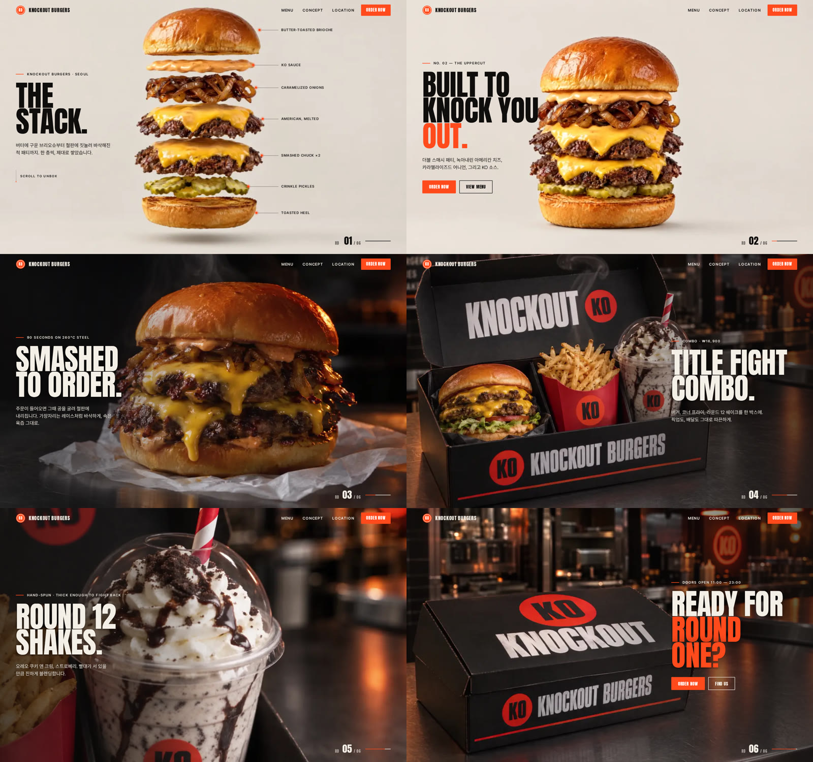

# Memoryz Royale

클래시로얄 스타일의 실시간 카드 배틀 웹 게임 (TypeScript + Three.js 3D 전장 + Phaser 3 UI).


## 실행

```bash
npm install
npm run dev      # http://localhost:5173
npm test         # 게임 로직 단위 테스트
npm run build    # dist/ 에 정적 빌드 (GitHub Pages 등에 그대로 배포 가능)
```

## 플레이 방법

- 메뉴의 **덱 편집**에서 15장 중 8장으로 덱을 짭니다 (브라우저에 저장됨).
- 메뉴에서 AI 난이도(쉬움/보통/어려움)를 고릅니다. AI는 준비된 덱 3개 중 하나를 씁니다.
- 아래 카드를 **끌어서** 전장에 놓거나, 카드를 **탭한 뒤 전장을 탭**해서 배치합니다.
- 빨갛게 칠해진 곳에는 유닛을 놓을 수 없습니다 (주문은 어디든 가능).
  상대 프린세스 타워를 부수면 그 라인의 강 건너편까지 배치할 수 있습니다.
- 3분 경기, 마지막 1분은 엘릭서 2배. 동점이면 1분 연장전(먼저 크라운을 따면 승리).
- 킹타워를 부수면 즉시 3크라운 승리.

## 카드 (`src/data/cards.json`)

| 카드 | 비용 | 특징 |
| --- | --- | --- |
| ⚔️ 기사 | 3 | 튼튼한 근접 유닛 |
| 🏹 궁수 | 3 | 원거리 2명, 공중 공격 가능 |
| 🗿 자이언트 | 5 | 건물만 공격하는 탱커 |
| 👺 고블린 | 2 | 빠른 근접 3마리 |
| 🐉 아기 드래곤 | 4 | 공중 유닛, 범위 공격 |
| 💀 해골 군대 | 3 | 약한 해골 12마리 |
| 🔥 파이어볼 | 4 | 범위 주문 (타워에는 35% 피해) |
| 💣 대포 | 3 | 지상 방어 건물, 30초 후 소멸 |
| 🔫 머스킷병 | 4 | 긴 사거리, 공중 공격 가능 |
| 🤖 미니 페카 | 4 | 한 방이 매우 센 근접 유닛 |
| 🐗 호그 라이더 | 4 | 빠름, 건물만 공격, 강을 뛰어넘음 |
| 🪓 발키리 | 4 | 주변 360° 범위 공격 |
| 🦇 미니언 | 3 | 공중 유닛 3마리 |
| 🧨 폭탄병 | 2 | 원거리 범위 공격 (지상만) |
| 🎯 화살 | 3 | 넓은 범위의 약한 주문 |

밸런스는 `cards.json`의 숫자만 바꾸면 됩니다.

## 배포 (GitHub Pages)

`.github/workflows/ci.yml`이 모든 push에서 테스트와 빌드를 돌리고, 저장소 **기본 브랜치**에 push되면
https://memoryzkr-hash.github.io/memoryz/ 로 자동 배포합니다. 처음 한 번은 저장소 **Settings → Pages → Source**를
**GitHub Actions**로 바꾼 뒤, Actions 탭에서 CI를 다시 실행하면 됩니다.

폰에서는 위 주소를 열고 브라우저 메뉴의 **홈 화면에 추가**를 누르면 앱처럼 전체 화면으로 실행됩니다.

## 브랜드 사이트: Knockout Burgers (`/site/`)

재료 하나하나의 의미를 보여준 뒤, 재료가 합쳐져 버거가 되고 KO 박스에 담기는 과정을 스크롤로 재생하는 버거 브랜드 랜딩 페이지입니다. 모든 사진과 영상은 Higgsfield로 생성했습니다.



- **The Stack**: 공중에 분해된 버거, 재료마다 라벨.
- **재료 투어**: 스크롤할 때마다 카메라가 재료 하나로 다가가고, 그 재료가 왜 들어갔는지 설명이 바뀝니다 (바닥 번 → 브리오슈, 7개).
- **조립 → 포장 → 닫힘**: 재료가 내려앉아 버거가 되고, KO 박스가 올라와 담은 뒤 뚜껑이 닫힙니다. 세 클립이 같은 프레임으로 이어져 한 번에 찍은 것처럼 이어집니다.
- **The Lineup**: 메뉴 6종 사진, 컨셉 문구(스크롤 하이라이트), 숫자 카운트업, 매장 정보, 대형 워드마크 푸터.

```bash
npm run dev      # http://localhost:5173/site/
```

배포 후 주소는 https://memoryzkr-hash.github.io/memoryz/site/ 입니다.

```
site/index.html            페이지 마크업
src/site/main.ts           재료 데이터(INGREDIENTS), 장면 구성, 재료 투어 카메라, 라벨, 리빌·카운트업·주문 토스트
src/site/story.ts          프레임 시퀀스를 캔버스에 그리는 스크럽 플레이어 (cover 맞춤, 줌/팬, 배경색 채움)
public/site/seq/<장면>/    영상에서 16fps로 뽑은 WebP 프레임 (001.webp …)
public/site/menu/          메뉴 사진
```

재료 설명은 `main.ts`의 `INGREDIENTS`에서 고치면 됩니다. 장면 영상을 바꾸려면 새 클립에서 프레임을 다시 뽑고 `SCENES`의 프레임 수를 맞추세요.

```bash
ffmpeg -i clip.mp4 -vf "fps=16,scale=1280:-2" -c:v libwebp -quality 72 public/site/seq/stack/%03d.webp
```

## 구조

```
src/core/     게임 규칙 (Phaser 의존 없음, 결정적 20Hz 시뮬레이션)
  sim.ts        게임 생성, 카드 사용, 틱 진행, 승패 판정
  combat.ts     타겟팅, 공격, 스플래시
  movement.ts   다리를 통한 이동, 충돌 밀어내기
  ai.ts         규칙 기반 AI 상대
src/audio/    WebAudio로 합성한 효과음 (파일 없음)
src/render3d/ Three.js 3D 전장: 유닛/타워 모델(models.ts), 경기장(arena.ts),
              애니메이션·이펙트(world.ts), 카드 초상화 렌더링(cardArt.ts)
src/render/   화면 레이아웃 상수
src/ui/       손패, 엘릭서 바, 버튼
src/scenes/   메뉴 / 배틀 / 덱 편집 / 결과 씬
tests/        core 단위 테스트
```

게임 로직(`src/core`)이 렌더링과 분리되어 있어서, 나중에 멀티플레이 서버에서 그대로 재사용할 수 있습니다.
플레이어 입력은 모두 `playCard(state, { side, handIndex, x, y })` 명령 하나로 들어갑니다.

유닛과 타워는 외부 에셋 없이 코드로 만든 오리지널 3D 모델(카툰 셰이딩)이고, 카드 그림도 이 모델을 렌더링해서 만듭니다.
개발 중에는 `http://localhost:5173/showcase.html`에서 모든 모델을 가까이서 볼 수 있습니다 (`?towers`로 타워). 개발 계획은 [docs/PLAN.md](docs/PLAN.md)를 참고하세요.
