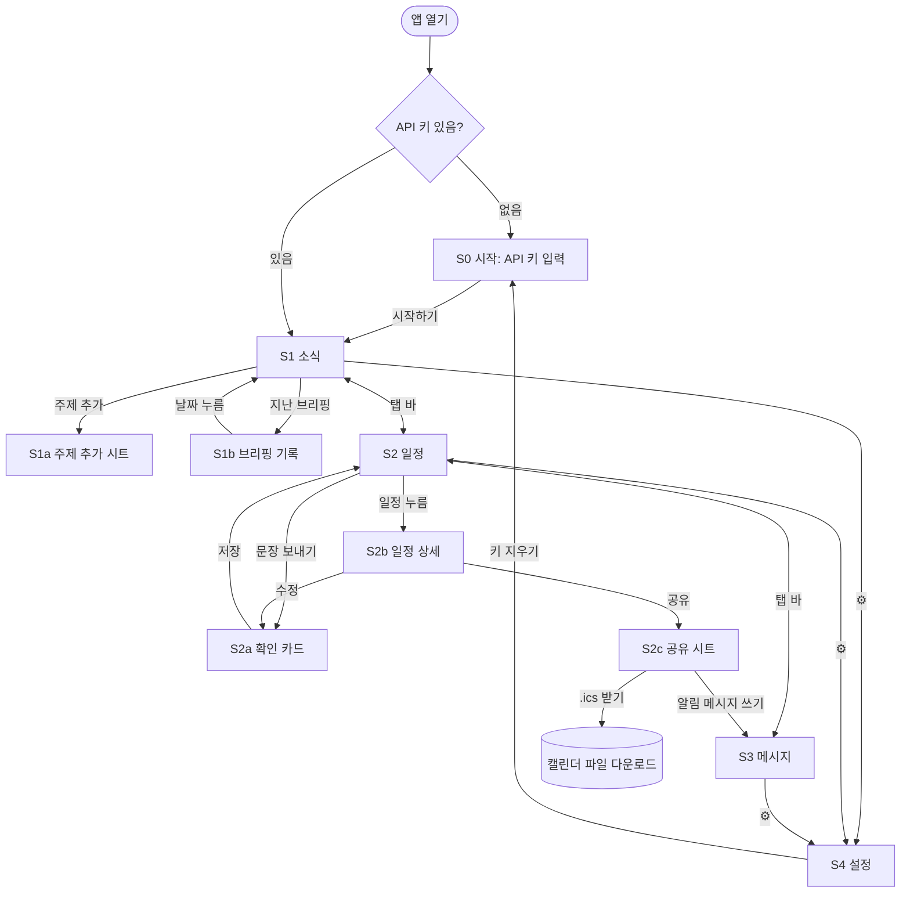

# 02 화면 설계 — 개인 비서

> 입력: [01-scope.md](01-scope.md) · 다음 단계: 03-data.md
> 기준 화면: 가로 **390px** 휴대폰 세로 화면. 넓은 화면에서는 가운데 390~480px 폭으로 보여 줍니다.

## 전체 구조

화면 아래 **탭 바** 3개(소식 · 일정 · 메시지)와, 위쪽 오른쪽 **⚙ 설정**으로 이루어집니다.
API 키가 없으면 어느 화면으로 들어와도 먼저 **시작 화면**이 나옵니다.



## 공통 요소

| 요소 | 내용 |
| --- | --- |
| 위쪽 바 (56px) | 왼쪽: 화면 이름 · 오른쪽: ⚙ 설정 버튼 |
| 아래 탭 바 (64px, 고정) | 📰 소식 · 📅 일정 · ✉️ 메시지. 지금 탭은 진하게 표시. 아이폰 홈 막대 영역(safe area)만큼 띄움 |
| 토스트 | 화면 아래, 탭 바 위에 2초간 표시 ("복사됨", "저장됨", "삭제됨 · 되돌리기") |
| 바텀 시트 | 아래에서 올라오는 창. 바깥을 누르거나 아래로 끌면 닫힘 |
| 누르는 곳 크기 | 버튼·칩·목록 행은 최소 44×44px |
| AI 기다리는 중 | 버튼이 "…중"으로 바뀌고 비활성. 같은 요청을 두 번 보내지 못하게 함 |

## S0 시작 — API 키 입력

처음 열었을 때, 또는 설정에서 키를 지웠을 때만 나옵니다. 탭 바는 숨깁니다.

```
┌──────────────────────────────────────┐
│                                      │
│            🤖 개인 비서               │
│   최신 소식 · 일정 · 메시지 초안       │
│                                      │
│  Anthropic API 키                    │
│  ┌────────────────────────────┬───┐  │
│  │ sk-ant-••••••••••••••••    │ 👁 │  │
│  └────────────────────────────┴───┘  │
│  🔒 키는 이 브라우저에만 저장됩니다.   │
│     서버로 보내지 않습니다.            │
│  키 받는 곳: console.anthropic.com ↗  │
│  ⚠ 콘솔에서 월 사용 한도를 걸어 두세요 │
│                                      │
│  ┌──────────────────────────────┐    │
│  │          시작하기             │    │
│  └──────────────────────────────┘    │
└──────────────────────────────────────┘
```

- **시작하기** → 키로 아주 짧은 시험 호출을 한 번 해 보고, 되면 저장하고 S1로 이동.

| 상태 | 보이는 것 |
| --- | --- |
| 입력 전 | 시작하기 비활성 |
| 확인 중 | 버튼이 "확인 중…" |
| 형식이 틀림 (`sk-ant-`로 시작 안 함) | 입력칸 아래 빨간 글씨 "API 키 형식이 아니에요" (호출 안 함) |
| 키 거절 (401) | "키가 맞지 않아요. 콘솔에서 다시 복사해 주세요" |
| 인터넷 없음 | "인터넷 연결을 확인해 주세요" + 다시 시도 |
| 저장 실패 (사생활 보호 모드 등) | "이 브라우저에서는 저장할 수 없어요. 일반 창에서 열어 주세요" |

## S1 소식 — 브리핑

```
┌──────────────────────────────────────┐
│ 소식                              ⚙  │
├──────────────────────────────────────┤
│ 내 주제 (3/5)                         │
│ [AI 도구 ×] [주식 ×] [게임 업데이트 ×] │
│ [＋ 주제]                             │
│                                      │
│ ┌──────────────────────────────────┐ │
│ │        🔍 브리핑 받기              │ │
│ └──────────────────────────────────┘ │
│ 마지막 브리핑: 오늘 08:12 · 지난 브리핑 › │
│                                      │
│ ┌ AI 도구 ─────────────────────────┐ │
│ │ • 요약 1줄                        │ │
│ │ • 요약 2줄                        │ │
│ │ • 요약 3줄                        │ │
│ │ 출처: 블로터 ↗ · The Verge [EN] ↗ │ │
│ └──────────────────────────────────┘ │
│ ┌ 주식 ────────────────────────────┐ │
│ │ ...                               │ │
├──────────────────────────────────────┤
│   📰 소식      📅 일정     ✉️ 메시지   │
└──────────────────────────────────────┘
```

- 주제 칩의 **×** → 바로 삭제하고 토스트 "삭제됨 · 되돌리기".
- **＋ 주제** → S1a. 주제가 5개면 비활성 + "주제는 5개까지예요".
- **브리핑 받기** → 주제마다 Claude 웹 검색. 결과 카드는 끝나는 주제부터 하나씩 나타남.
- 영어 출처는 `[EN]` 표시. 요약은 항상 한국어.
- 출처 링크는 새 탭으로 열림.
- 오늘 이미 받은 브리핑이 있으면 그걸 먼저 보여 주고, 버튼 글자는 "다시 받기".

| 상태 | 보이는 것 |
| --- | --- |
| 주제 0개 | 카드 자리에 "관심 있는 주제를 추가해 보세요" + 예시 칩 [AI 도구] [주식] [게임 업데이트] (누르면 바로 추가). 브리핑 버튼 비활성 |
| 주제는 있고 브리핑 0개 | "🔍 브리핑 받기를 눌러 오늘 소식을 모아 보세요" |
| 검색 중 | 버튼 → "검색 중… (1/3)" + **취소**. 아직 안 끝난 주제 카드는 회색 뼈대(스켈레톤) |
| 한 주제만 실패 | 그 카드만 "이 주제는 불러오지 못했어요 [다시 시도]", 나머지는 정상 표시 |
| 소식 없음 | 그 카드에 "최근 소식을 찾지 못했어요" |
| 키 거절 (401) | 위쪽 빨간 띠 "API 키가 맞지 않아요 [설정에서 바꾸기]" |
| 사용 한도 초과 / 너무 잦은 요청 (429) | "잠시 후 다시 시도해 주세요" |
| 인터넷 없음 | "인터넷 연결을 확인해 주세요" + 다시 시도. 저장된 지난 브리핑은 그대로 보임 |

### S1a 주제 추가 (바텀 시트)

```
┌──────────────────────────────────────┐
│ 주제 추가                         ✕  │
│ ┌──────────────────────────────────┐ │
│ │ 예: 반도체 수출, 클래시로얄 패치     │ │
│ └──────────────────────────────────┘ │
│                               12/30  │
│ ┌──────────────────────────────────┐ │
│ │              추가                 │ │
│ └──────────────────────────────────┘ │
└──────────────────────────────────────┘
```

| 상태 | 보이는 것 |
| --- | --- |
| 비었거나 공백만 | 추가 비활성 |
| 너무 김 | 글자 수 빨간색, 추가 비활성 (최대 길이와 세는 법은 03단계에서 정함) |
| 이미 있는 주제 | "이미 있는 주제예요" |

### S1b 지난 브리핑

- 날짜별 목록 (최신이 위). 행: "10월 6일 (화) 08:12 · 주제 3개".
- 누르면 S1에서 그 날 브리핑을 보여 주고, 위에 "10월 6일 브리핑 보는 중 · 오늘로 돌아가기" 띠 표시.
- 비었을 때: "아직 받은 브리핑이 없어요".

## S2 일정

```
┌──────────────────────────────────────┐
│ 일정                              ⚙  │
├──────────────────────────────────────┤
│ ┌──────────────────────────────┬───┐ │
│ │ 말하듯 적어 보세요              │ ➤ │ │
│ └──────────────────────────────┴───┘ │
│ [＋ 직접 입력]                        │
│                                      │
│ 오늘 · 10월 6일 (화)                  │
│  15:00  치과                    ›    │
│                                      │
│ 이번 주                               │
│  10/8 (목) 19:00  저녁 약속      ›    │
│                                      │
│ 나중                                  │
│  10/13 (화) 15:00  민수 미팅     ›    │
│             📍 강남역                 │
│                                      │
│ ▸ 지난 일정 (4)                       │
├──────────────────────────────────────┤
│   📰 소식      📅 일정     ✉️ 메시지   │
└──────────────────────────────────────┘
```

- 입력 후 **➤** → Claude가 해석 → S2a 확인 카드.
- **＋ 직접 입력** → 빈 S2a (AI 호출 없음). AI 없이도 일정은 만들 수 있어야 함.
- 일정 행 → S2b.
- 지난 일정은 접혀 있고, 누르면 펼쳐짐.

| 상태 | 보이는 것 |
| --- | --- |
| 일정 0개 | "예: 다음 주 화요일 3시 강남역에서 민수랑 미팅" 회색 예시. 누르면 입력칸에 채워짐 |
| 해석 중 | ➤ 자리에 도는 표시, 입력칸 잠김 |
| 날짜를 못 찾음 | 확인 카드를 열되 날짜 칸을 비우고 노란색 "날짜를 골라 주세요" |
| 키·인터넷 오류 | "지금은 AI를 쓸 수 없어요 [직접 입력]" — 직접 입력으로 이어 가게 함 |

### S2a 확인 카드 (바텀 시트)

```
┌──────────────────────────────────────┐
│ 일정 확인                         ✕  │
│ 제목   [ 민수 미팅               ]    │
│ 날짜   [ 2026-10-13 (화)    📅 ]      │
│ 시작   [ 15:00 ]   끝 [ --:-- ]      │
│ 장소   [ 강남역                  ]    │
│ 메모   [                         ]    │
│                                      │
│ 💡 "다음 주 화요일"을 10월 13일로      │
│    읽었어요. 맞는지 확인해 주세요.      │
│ ┌───────────────┐ ┌───────────────┐  │
│ │     취소       │ │     저장       │  │
│ └───────────────┘ └───────────────┘  │
└──────────────────────────────────────┘
```

- AI가 채운 칸은 연한 파란 배경, 확실하지 않은 칸은 노란 테두리.
- AI가 상대적인 날짜("다음 주", "모레")를 해석했으면 💡 줄로 어떻게 읽었는지 보여 줌.
- **저장** → S2 목록으로, 토스트 "저장됨". 수정에서 왔으면 기존 일정을 바꿈.

| 상태 | 보이는 것 |
| --- | --- |
| 제목 또는 날짜 비어 있음 | 저장 비활성 |
| 끝 시간이 시작보다 빠름 | "끝 시간이 시작보다 빨라요" |
| 지난 날짜 | 노란 경고 "이미 지난 날짜예요" (저장은 가능) |
| 저장 실패 | "저장하지 못했어요. 브라우저 저장 공간을 확인해 주세요" |

### S2b 일정 상세

- 제목, 날짜·시간, 장소, 메모 표시.
- 버튼 3개: **수정**(→ S2a) · **공유**(→ S2c) · **삭제**(확인 창 "이 일정을 지울까요?" → 목록, 토스트 "삭제됨 · 되돌리기").

### S2c 공유 (바텀 시트)

```
┌──────────────────────────────────────┐
│ 일정 공유                         ✕  │
│ 📅 10/13 (화) 15:00 민수 미팅 · 강남역 │
│                                      │
│  📥 캘린더 파일(.ics) 받기             │
│     받은 사람이 열면 자기 캘린더에 추가 │
│                                      │
│  ✉️ 알림 메시지 쓰기                   │
│     일정 내용을 넣어 초안을 써 줘요     │
└──────────────────────────────────────┘
```

- **.ics 받기** → `민수-미팅-2026-10-13.ics` 다운로드, 토스트 "파일을 받았어요".
- **알림 메시지 쓰기** → S3로 이동, 일정이 미리 채워짐.

## S3 메시지

```
┌──────────────────────────────────────┐
│ 메시지                            ⚙  │
├──────────────────────────────────────┤
│ 📅 10/13 (화) 15:00 민수 미팅 · 강남역 ✕│  ← 일정에서 왔을 때만
│                                      │
│ 누구에게                               │
│ [상사] [동료] [친구] [가족] [고객] [직접] │
│ 이름 (선택)  [ 민수              ]    │
│                                      │
│ 하고 싶은 말                           │
│ ┌──────────────────────────────────┐ │
│ │ 미팅 장소 알려 주고 늦지 말라고      │ │
│ └──────────────────────────────────┘ │
│ 말투   (● 정중하게) (○ 편하게)          │
│ ┌──────────────────────────────────┐ │
│ │          ✍️ 초안 쓰기              │ │
│ └──────────────────────────────────┘ │
│ ┌ 초안 1 ──────────────────────────┐ │
│ │ 민수야, 다음 주 화요일(13일) 3시에  │ │
│ │ 강남역에서 보자! ...               │ │
│ │                        [📋 복사]  │ │
│ └──────────────────────────────────┘ │
│ ┌ 초안 2 ──────────────────────────┐ │
│ │ ...                     [📋 복사]  │ │
│ └──────────────────────────────────┘ │
│ [↻ 다시 쓰기]                         │
├──────────────────────────────────────┤
│   📰 소식      📅 일정     ✉️ 메시지   │
└──────────────────────────────────────┘
```

- 받는 사람 칩 하나 선택 (기본: 선택 안 함 → 초안 쓰기 비활성). **직접**을 누르면 관계를 글로 입력.
- 위쪽 일정 띠의 **✕** → 일정 정보를 빼고 일반 메시지로 씀.
- **복사** → 클립보드에 복사, 버튼이 1초간 "✓ 복사됨".
- **다시 쓰기** → 같은 입력으로 초안 2개 새로 받음.
- 초안 글은 직접 고칠 수 있음 (복사 전에 손보기).

| 상태 | 보이는 것 |
| --- | --- |
| 받는 사람 또는 하고 싶은 말이 비어 있음 | 초안 쓰기 비활성 |
| 쓰는 중 | 버튼 "쓰는 중…", 초안 자리에 회색 뼈대 |
| 실패 (키·인터넷) | "초안을 받지 못했어요 [다시 시도]". 입력한 내용은 그대로 둠 |
| 복사 실패 (클립보드 권한 없음) | 초안 글 전체를 선택해 두고 "길게 눌러 복사해 주세요" |
| 다른 탭에 갔다 옴 | 입력과 초안이 그대로 남아 있음 (탭 전환으로 날아가지 않게) |

## S4 설정

| 항목 | 내용 |
| --- | --- |
| API 키 | `sk-ant-…ab12`처럼 끝 4자리만 표시 · **바꾸기**(S0와 같은 입력) · **지우기**(확인 → S0) |
| 주제당 검색 횟수 | 1~5, 기본 3. "많을수록 정확하지만 비용이 늘어요" |
| 브리핑 언어 | (● 한국어 + 영어 기사) (○ 한국어 기사만) — 요약은 항상 한국어 |
| 모든 데이터 지우기 | 확인 창 "주제, 브리핑, 일정, API 키가 모두 지워져요" → S0 |
| 정보 | 버전, "데이터는 이 브라우저에만 저장돼요" |

## 기능 ↔ 화면 연결 확인

| 01-scope 완료 조건 | 확인하는 화면 |
| --- | --- |
| 주제 2개 등록 → 1분 안에 주제별 요약 | S1a → S1 (검색 중 → 결과) |
| 요약마다 출처 링크 | S1 결과 카드 |
| 새로고침 후 주제·오늘 브리핑 유지 | S1 |
| 키 틀림·인터넷 끊김 시 오류 문구 | S0, S1, S2, S3 상태 표 |
| 예시 문장 → 다음 주 화요일 15:00 확인 카드 | S2 → S2a |
| 시간 고쳐서 저장 → 목록 반영 | S2a → S2 |
| `.ics`로 캘린더에 추가 | S2b → S2c |
| 새로고침 후 일정 유지 | S2 |
| 초안 2개 | S3 |
| 복사 → 카톡에 붙여 넣기 | S3 복사 버튼 |
| 일정 공유에서 시작하면 일정 정보 포함 | S2c → S3 일정 띠 |

## 03단계에 넘길 것
- 주제 최대 길이와 글자 세는 법(이모지·한글) — S1a
- 브리핑 기록을 며칠치 남길지 — S1b
- 메시지 입력·초안을 새로고침 후에도 남길지 (지금 설계: 탭 전환까지만 유지, 새로고침하면 사라짐)
- 일정 해석 결과에 "확실하지 않은 칸" 표시를 어떻게 담을지 — S2a
- "삭제됨 · 되돌리기"를 위해 지운 항목을 잠깐 들고 있는 방법
