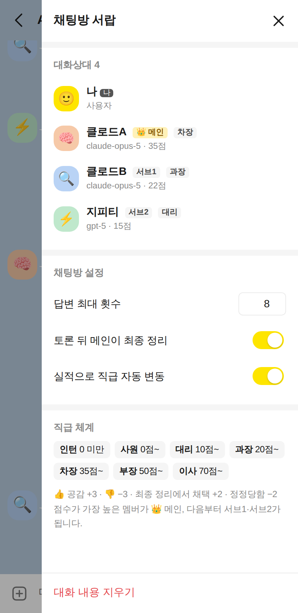
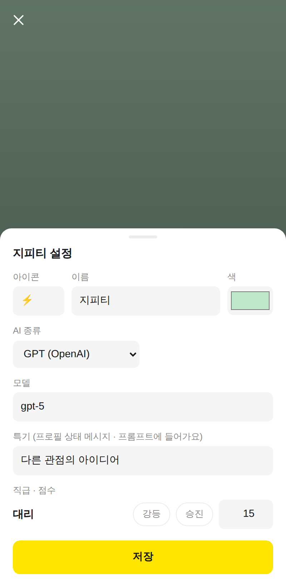

# AI 단톡방 (Claude × 2 + GPT 오케스트레이션)

클로드 두 명과 지피티가 카카오톡 같은 단톡방에서 서로의 답을 보완합니다.
직급은 실적에 따라 오르내리고, 점수가 가장 높은 멤버가 👑 메인이 됩니다.

<p>



</p>

## 실행

```bash
cd orchestra
npm install
cp .env.example .env   # ANTHROPIC_API_KEY, OPENAI_API_KEY 입력
npm start              # http://localhost:8787
```

키 없이 화면과 흐름만 보려면 `ORCHESTRA_DEMO=1 npm start` 로 켜세요 (정해진 답을 하는 가짜 멤버).

### API 키 준비

- **Claude**: https://console.anthropic.com → API Keys 에서 키를 만들어 `ANTHROPIC_API_KEY` 에 넣습니다.
- **지피티**: ChatGPT 로그인 계정(이메일·비밀번호, Plus 구독)으로는 연결할 수 없습니다.
  https://platform.openai.com/api-keys 에서 **API 키**를 만들고 결제 수단(크레딧)을 등록한 뒤 `OPENAI_API_KEY` 에 넣으세요.
  API 사용료는 ChatGPT 구독과 따로 청구됩니다.

키는 `.env` 파일에만 두세요. `.env` 는 git 에 올라가지 않습니다.

## 휴대폰에서 접속

서버를 켠 컴퓨터와 **같은 와이파이**에 있는 휴대폰에서 바로 들어올 수 있습니다.

1. `.env` 에 `ROOM_PASSWORD=원하는비밀번호` 를 정합니다 (없으면 같은 와이파이의 누구나 내 API 키로 대화할 수 있어요).
2. `npm start` 를 하면 터미널에 `http://192.168.x.x:8787` 주소와 **QR 코드**가 나옵니다.
3. 휴대폰 카메라로 QR 을 찍거나 주소를 열고 비밀번호를 입력합니다. 로그인은 30일 유지됩니다.
4. **홈 화면에 추가**하면 앱처럼 전체 화면으로 열립니다
   (아이폰: Safari 공유 버튼 → 홈 화면에 추가 / 안드로이드: Chrome 메뉴 → 홈 화면에 추가).

접속이 안 되면 컴퓨터 방화벽에서 8787 포트(또는 Node.js)를 허용해 주세요. 윈도우는 처음 켤 때 뜨는 방화벽 창에서 "개인 네트워크 허용"을 누르면 됩니다.

### 밖에서(LTE·다른 와이파이) 접속

집 컴퓨터를 켜 둔 상태로 [Cloudflare Tunnel](https://developers.cloudflare.com/cloudflare-one/connections/connect-networks/do-more-with-tunnels/trycloudflare/) 을 쓰면
계정 없이 https 주소를 받을 수 있습니다.

```bash
cloudflared tunnel --url http://localhost:8787
# → https://xxxx.trycloudflare.com 주소가 나옵니다
```

인터넷 어디서나 들어올 수 있는 주소이니 `ROOM_PASSWORD` 를 반드시 정하세요. 주소는 터널을 다시 켤 때마다 바뀝니다.

## 멤버와 포지션

처음 구성은 다음과 같습니다. 이름·아이콘·AI 종류·모델·생각 깊이·특기는 **프로필 → 모델 설정**에서 멤버마다 바꿀 수 있습니다.

| 포지션 | 멤버 | 처음 모델 | 처음 직급 | 하는 일 |
| --- | --- | --- | --- | --- |
| 👑 메인 | 🧠 클로드A | `claude-opus-5` | 차장 (35점) | 먼저 답하고 방향·초안을 잡음, 토론 뒤 최종 정리와 인사고과 |
| 서브1 | 🔍 클로드B | `claude-opus-5` | 과장 (20점) | 검증: 버그·빠진 요구사항·엣지 케이스·보안 |
| 서브2 | ⚡ 지피티 | `gpt-5` | 대리 (10점) | 대안: 다른 관점·반론·더 단순한 방법 |

포지션은 점수 순서로 정해집니다. 지피티가 실적을 쌓아 점수가 가장 높아지면 지피티가 메인이 되어 먼저 답하고 최종 정리를 합니다.

## 직급

| 인턴 | 사원 | 대리 | 과장 | 차장 | 부장 | 이사 |
| --- | --- | --- | --- | --- | --- | --- |
| 0 미만 | 0~ | 10~ | 20~ | 35~ | 50~ | 70~ |

점수가 바뀌는 경우:

- 말풍선을 눌러 **👍 공감 +3**, **👎 −3** (다시 누르면 취소)
- 메인이 최종 정리 끝에 남기는 **인사고과**: 의견이 결론에 **채택**된 멤버 +2, 틀려서 **정정당한** 멤버 −2
  (메인은 자기 자신을 채택할 수 없고, 이번 토론에서 말하지 않은 멤버도 채택 점수를 못 받습니다)
- 프로필 설정에서 **승진/강등** 버튼이나 점수를 직접 입력

직급이나 메인이 바뀌면 방에 "🎉 지피티님이 과장(으)로 승진했습니다", "👑 지피티님이 새 메인이 되었습니다"처럼 공지가 올라옵니다.
서랍의 "실적으로 직급 자동 변동"을 끄면 공감과 인사고과로는 점수가 변하지 않습니다.

## 부르는 방법

- **그냥 말하기**: 메인이 먼저 답하고 서브들이 차례로 보완합니다. 더할 말이 없는 멤버는 넘기고, 두 명 이상 의견을 냈으면 메인이 📌 최종 정리를 합니다.
- **@멘션**: `@클로드B`, `@지피티`, `@메인`, `@서브1`, `@모두` 처럼 부르면 그 멤버가 먼저 답하고 이후 토론이 이어집니다. 입력창에 `@`를 치면 멤버 목록이 뜹니다.
- **직접 호출**: 입력창 왼쪽 **＋** 버튼이나 프로필의 **직접 호출**을 누르면, 다음 메시지에는 그 멤버 **혼자만** 답합니다 (보완·정리 없음).

그 밖에 AI가 답하는 중에도 메시지를 보낼 수 있고, 전송 버튼 자리의 ■ 로 바로 멈출 수 있습니다.
프로필의 내보내기/초대하기로 멤버를 방에서 빼거나 다시 넣을 수 있고, 🔍 로 대화를 검색할 수 있습니다.
멤버 설정·직급·대화는 `orchestra/data/room.json`에 저장돼서 서버를 다시 켜도 이어집니다.

## 환경 변수 (`.env`)

| 변수 | 설명 |
| --- | --- |
| `ANTHROPIC_API_KEY` | Claude 멤버가 사용 |
| `OPENAI_API_KEY` | GPT 멤버가 사용 |
| `ROOM_PASSWORD` | 방 비밀번호. 다른 기기에서 접속할 때 필요 |
| `PORT` | 서버 포트 (기본 8787) |
| `HOST` | 기본 `0.0.0.0`(같은 와이파이에서 접속 가능). 이 컴퓨터에서만 쓰려면 `127.0.0.1` |

키가 없는 종류의 멤버는 "API 키 없음"으로 표시되고 답하지 않습니다.
`claude-opus-5`, `claude-fable-5-1` 요청에는 서버 측 거절 폴백(`fallbacks: "default"`)을 켜 두었습니다.

## 구조

- `src/orchestrator.ts` — 차례 정하기, PASS/멘션/직접 호출, 최종 정리, 인사고과와 공감 점수 (`Room`)
- `src/ranks.ts` — 직급표, 포지션(메인/서브) 계산, 포지션별 임무
- `src/prompts.ts` — 멤버별 시스템 프롬프트, 대화 기록을 각 멤버 기준 user/assistant 턴으로 변환
- `src/agents.ts` — 처음 멤버 구성과 Claude(Anthropic SDK) / GPT(OpenAI SDK) 스트리밍 호출
- `src/server.ts` — HTTP + SSE 서버 (`node:http`), 접속 주소·QR 출력
- `src/auth.ts` — `ROOM_PASSWORD` 로그인 (쿠키, 10번 틀리면 10분 잠금)
- `public/` — 카카오톡 스타일 웹 UI
- `test/` — 가짜 멤버로 진행 규칙과 직급 변동을 검증하는 테스트 (`npm test`)
