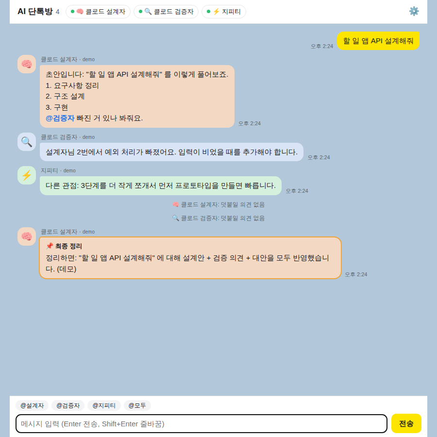

# AI 단톡방 (Claude × 2 + GPT 오케스트레이션)

클로드 두 명과 지피티가 한 방에서 서로의 답을 보완하는 단톡방입니다.



| 멤버 | 모델 (기본값) | 역할 |
| --- | --- | --- |
| 🧠 클로드 설계자 | `claude-opus-5` | 리드. 먼저 답하고 설계·초안을 잡고, 토론이 끝나면 최종 정리 |
| 🔍 클로드 검증자 | `claude-opus-5` | 버그·빠진 요구사항·엣지 케이스·보안 문제를 찾아 수정안 제시 |
| ⚡ 지피티 | `gpt-5` | 다른 관점의 대안·반론·더 단순한 방법 제시 |

## 실행

```bash
cd orchestra
npm install
cp .env.example .env   # ANTHROPIC_API_KEY, OPENAI_API_KEY 입력
npm start              # http://localhost:8787
```

키 없이 화면과 흐름만 보려면 `ORCHESTRA_DEMO=1 npm start` 로 켜세요 (정해진 답을 하는 가짜 멤버).
키가 없는 멤버는 방에 들어오지 못하고 "키 없음"으로 표시됩니다.

## 진행 방식 (오케스트레이션)

1. 사용자가 말하면 **설계자**가 먼저 답합니다. `@검증자`, `@지피티`, `@모두`처럼 부르면 그 멤버가 먼저 답합니다.
2. 나머지 멤버가 차례로 대화 전체를 보고 **빠진 점·틀린 점·대안만** 덧붙입니다. 더할 말이 없으면 `[PASS]` 합니다
   (화면에는 "덧붙일 의견 없음"으로만 표시).
3. 누군가 새로 말하면 다른 멤버들이 다시 발언 기회를 얻습니다. 발언 속 `@멘션`은 다음 차례를 그 멤버에게 넘깁니다.
4. 전원이 PASS 하거나 최대 발언 횟수(기본 8)에 닿으면 끝납니다. 두 명 이상이 의견을 냈다면 설계자가
   **📌 최종 정리**를 올립니다.

AI들이 답하는 중에도 메시지를 보낼 수 있고, **중지** 버튼으로 바로 멈출 수 있습니다.
상단 멤버 칩을 눌러 멤버를 내보내거나 다시 초대할 수 있습니다 (예: 지피티를 불러들이기).
대화는 `orchestra/data/room.json`에 저장돼서 서버를 다시 켜도 이어집니다.

## 설정 (`.env`)

| 변수 | 기본값 | 설명 |
| --- | --- | --- |
| `ANTHROPIC_API_KEY` | | 클로드 두 명이 사용 |
| `OPENAI_API_KEY` | | 지피티가 사용 |
| `CLAUDE_A_MODEL` / `CLAUDE_B_MODEL` | `claude-opus-5` | 설계자 / 검증자 모델 |
| `CLAUDE_EFFORT` | `medium` | 클로드의 생각 깊이 (`low`~`max`). 높을수록 느리고 비쌈 |
| `OPENAI_MODEL` | `gpt-5` | 지피티 모델 |
| `PORT` | `8787` | 서버 포트 |

클로드 요청에는 서버 측 거절 폴백(`fallbacks: "default"`)을 켜 두었습니다. 안전 분류기가 요청을 거절하면
API가 다른 모델로 자동 재시도합니다.

## 구조

- `src/orchestrator.ts` — 차례 정하기, PASS/멘션 처리, 최종 정리 (`Room`)
- `src/prompts.ts` — 멤버별 시스템 프롬프트, 대화 기록을 각 멤버 기준 user/assistant 턴으로 변환
- `src/agents.ts` — 멤버 정의와 Claude(Anthropic SDK) / GPT(OpenAI SDK) 스트리밍 호출
- `src/server.ts` — HTTP + SSE 서버 (의존성 없는 `node:http`)
- `public/` — 메신저 스타일 웹 UI
- `test/` — 가짜 멤버로 진행 규칙을 검증하는 테스트 (`npm test`)
